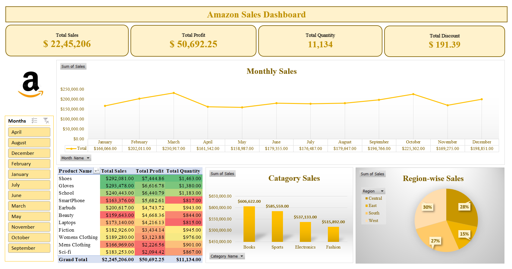

# 💡Excel Project by Yash Yennewar

# 📊 Amazon Sales Data Analysis
An interactive Excel dashboard that analyzes Amazon sales performance across time, products, categories, and regions to deliver clear business insights. 

---

## 📌 Project Overview

This project presents an **end-to-end Amazon Sales Data Analysis** built entirely in **Microsoft Excel**. The goal is to transform raw sales data into meaningful insights using **data cleaning, pivot tables, formulas, slicers, and interactive dashboards**.
The dashboard enables stakeholders to quickly understand **sales trends, profitability, product performance, category contribution, and regional distribution**.

<a href ="Amazon Sales Data Analysis.xlsx">Amazon_Sales_Data_Analysis</a>

---

## 🎯 Objectives

* Analyze overall **sales, profit, quantity, and discount** metrics
* Identify **monthly sales trends**
* Compare **product-wise performance**
* Evaluate **category-wise and region-wise sales distribution**
* Create an **interactive and visually appealing Excel dashboard**

---

## 📈 Key KPIs Displayed

* **Total Sales:** $2,245,206
* **Total Profit:** $50,692.25
* **Total Quantity Sold:** 11,134 units
* **Total Discount:** $191.39

These KPIs provide a quick executive summary of overall business performance.

---

## 🛠 Tools & Techniques Used

* **Microsoft Excel**
* Pivot Tables & Pivot Charts
* Excel Formulas (SUM, CALCULATE logic, aggregations)
* Conditional Formatting
* Slicers for interactivity
* Dashboard design & layout optimization

---

## 📂 Dataset Information

The dataset contains the following key fields:

* Order ID, Order Date
* Customer ID & Segment
* Product Name & Category
* Region & Location
* Sales, Quantity, Discount, Profit

(Data used for learning and analytical purposes)

---

## 📊 Dashboard Visuals & Insights

### 1️⃣ Monthly Sales Trend

* Line chart showing sales performance from **January to December**
* Helps identify **peak months (March & October)** and low-performing periods

### 2️⃣ Product-wise Analysis

* Table displaying **Total Sales, Total Profit, and Total Quantity** by product
* Conditional formatting highlights **top and low performers**
* Useful for **inventory and pricing decisions**

### 3️⃣ Category-wise Sales

* Column chart comparing categories such as:

  * Books
  * Sports
  * Electronics
  * Fashion
* Books and Sports contribute the **highest revenue share**

### 4️⃣ Region-wise Sales Distribution

* Pie chart showing sales contribution by region:

  * West (30%)
  * Central (28%)
  * South (27%)
  * East (15%)
* Helps identify **regional market strength**

### 5️⃣ Interactive Filters (Slicers)

* Month slicer allows dynamic filtering of all visuals
* Enhances **user-driven analysis and exploration**

## 📸 Dashboard Preview

---

## 🚀 Business Use Cases

* Sales performance tracking
* Identifying high-performing products & categories
* Regional sales comparison
* Monthly trend analysis
* Dashboard showcase for **Data Analyst / Business Intelligence portfolios**

---

## 🧠 Skills Demonstrated

* Data cleaning & preparation
* Business data analysis
* KPI creation
* Dashboard storytelling
* Excel-based BI reporting

---
